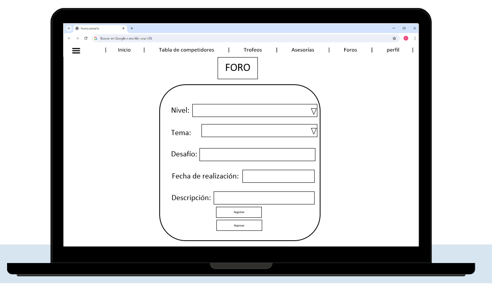
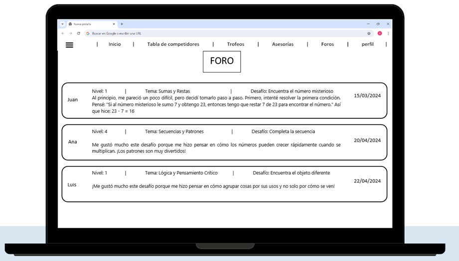
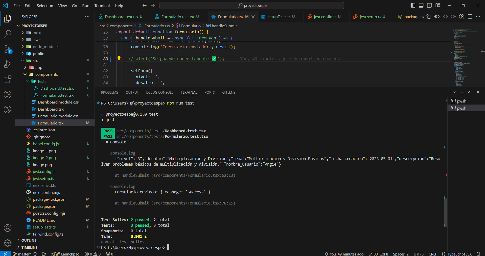

# Proyecto
            TECNOLÓGICO NACIONAL DE MÉXICO 
            INSTITUTO TECNOLÓGICO DE COLIMA 
         Ingeniería en Sistemas Computacionales 
         Periodo: Enero – Junio 2024 
         Materia: Aplicaciones Web Modernas 
         Docente: Patricia Elizabeth Figueroa Millan 
         Estudiante: Angie Noemi Celestino Valencia-20460159
         
         Villa de Álvarez, Colima; 30 de Mayo del 2024


En esta actividad  objetivo es organizar la base de datos de nuestro proyecto, en mi caso un sitio web, de desafios matematicos para niños de 6 a 12 años de edad. 

En este readme esta redactado todo lo que necesitamos para iniciar y desarrollar la actividad.

## Instrucciones de instalación y ejecución de API.

Tener instalados: 
- [Node.js](https://www.nodejs.org)
- [Docker](https://www.docker.com)


1. Clonar el repositorio en la máquina local:
   
   ```sh
   git clone https://github.com/AngieNoemiCV/Proyecto-Final
   ```

2. Navegar al directorio del proyecto:
   
   ```sh
   cd node-restful
   ```

3. Ejecutar el siguiente comando para iniciar los contenedores:

    ```sh
    docker-compose up -d
    ```

    > **IMPORTANTE**
    >
    > Debe estar iniciado el Docker engine para ejecutar el comando anterior,
    > si no lo está, se devolverá un mensaje de error indicando que no se
    > encontró el docker daemon.

4. La API estará disponible en `http://localhost:3100`.

## Instrucciones de instalación y ejecución del FrontEnd.

1. Clonar el repositorio en la máquina local:
   
   ```sh
   git clone https://github.com/AngieNoemiCV/proyectoespeweb.git
   ```

2. En terminal entrar a la carpeta donde se guardo
   
   ```sh
   cd (nombre de carpeta)
   ```

3. Luego entrar al proyecto

    ```sh
    cd (nombreproyecto)
    ```
4. Correr el proyecto 

    ```sh
    npm run dev
    ```

    > **IMPORTANTE**
    >
    > Debe estar iniciado el Docker engine para ejecutar el comando anterior,
    > si no lo está, se devolverá un mensaje de error indicando que no se
    > encontró el docker daemon.

## Descripción del proyecto (estructura y uso del proyecto)

### El proyecto está organizado de la siguiente manera:

1. Directorios y Archivos Principales

**public/:** Contiene imágenes y otros archivos públicos accesibles desde la raíz del servidor web.

      figuras.jpg
      figuras.png
      numeros.jpg
      next.svg
      vercel.svg
    
**src/:** Contiene el código fuente del proyecto.

   app/: Directrices de la aplicación.

      favicon.ico
      globals.css
      layout.tsx
      page.tsx

   components/: Contiene los componentes reutilizables de la aplicación.

      Dashboard.tsx
      Formulario.tsx
      Dashboard.module.css
      Formulario.module.css

   formul/: Contiene la página de formulario.

      page.tsx

**.eslintc.json:** Archivo de configuración para ESLint.

**.gitignore:** Define los archivos y directorios que Git debe ignorar.

**next.config.js:** Configuración de Next.js.

**package.json:** Manejo de dependencias y scripts del proyecto.

**package-lock.json:** Versión bloqueada de las dependencias.

**postcss.config.js:** Configuración de PostCSS.

2. Componentes

**Formulario.tsx**

Este componente renderiza un formulario para crear nuevos desafíos. Se utiliza useState para manejar el estado del formulario y useEffect para cargar los temas disponibles según el nivel seleccionado. Aquí está la estructura del estado del formulario:

      interface FormState {
      nivel: string;
      desafio: string;
      tema: string;
      fecha_creacion: string;
      descripcion: string;
      nombre_usuario: string; // Nuevo campo
      }

El formulario incluye campos para:

      Nivel
      Tema
      Desafío
      Fecha de creación
      Descripción
      Nombre de usuario

El componente también maneja el envío del formulario mediante una petición POST al servidor local.

**Dashboard.tsx**

Este componente muestra una lista de desafíos cargados desde el servidor. Utiliza useState para manejar el estado de los datos y useEffect para realizar una petición GET al cargar el componente. Cada desafío en la lista muestra los siguientes campos:

      Nombre de usuario
      Desafío
      Nivel
      Tema
      Fecha de creación
      Descripción

3. Estilos

**Formulario.module.css:** Contiene los estilos específicos para el componente de formulario.
**Dashboard.module.css:** Contiene los estilos específicos para el componente de dashboard.
**globals.css:** Estilos globales de la aplicación.

4. Dependencias y Scripts

El archivo package.json maneja las dependencias del proyecto y scripts necesarios para ejecutar la aplicación. Las principales dependencias son React y Next.js.

### Uso del proyecto

1. Instalación de Dependencias

Para instalar las dependencias del proyecto, se ejecuta el siguiente comando:

      npm install

2. Ejecución de la Aplicación

Para ejecutar la aplicación en un entorno de desarrollo, se utiliza el siguiente comando:

      npm run dev

3. Navegación

La página principal carga el componente Dashboard.

Se puede acceder al formulario para crear un nuevo desafío a través de un enlace en el dashboard.

### Descripción de las Funcionalidades

***Formulario de Creación de publicaciones para el foro***

Permite a los usuarios crear nuevas publicaciones rellenando un formulario con varios campos, incluyendo el nivel y el tema que se actualizan dinámicamente según la selección del nivel.

***Dashboard de publicaciones ya generadas***

Muestra una lista de publicaciones creados, permitiendo a los usuarios ver detalles como el nombre de otro usuario que haya publicado, nivel, tema, fecha de creación y descripción de como se sintio durante el desafío.


## Prototipos de la vista y cómo utilizarlas (tipo manual)
#### Form:

En esta pantalla el usuario podrá ingresar los datos, dentro de nivel se muestra una lista de los 6 niveles y cada nivel mostrara distintos temas. El nombre del desafio tendra que ingresarlo el usuario la fecha de realización y en descripción describira como se sintio o como le parecio ese desafío. 

Estará un botón de agregar y otro para regresar al dashboard donde estaran reflejados todas las publicaciones del foro. 


#### Dashboard:
En esta pantalla se mostrará las publicaciones del foro, se vera reflejado el nombre del usuario, y toda la informacion antes registrada en el formulario.



## Descripción de las pruebas y cómo ejecutarlas.


1. Explicación de los Test

***Dashboard Test:***

Recupera y muestra los datos correctamente: Este test verifica que los datos se recuperan del endpoint y se muestran correctamente en el componente Dashboard.

***Formulario Test:***

Envía los datos correctamente al servicio web: Este test simula la entrada de datos en el formulario y el evento de envío, asegurándose de que los datos se envían correctamente al endpoint.
Renderiza el formulario con los datos esperados: Este test verifica que los campos del formulario se renderizan correctamente.

2. Comando para ejecutar testing

         npm run test


[Video de referencia](https://youtu.be/u5A7GnQEKbg?si=thBiQc8Bbmt7TCUZ)


    > **IMPORTANTE**
    > En la linea 80 del componente Formulario.tsx se debe comentar, ya que al ser un alter al momento del test mandara un error.
    > Una vez ejecutada la prueba, se recomienda descomentar para que en la ejecucion del comando npm run dev, aparezca el mesaje.

## Repositorios

Enlace para entrar al repositorio del FrontEnd:  [GitHub FrontEnd](https://github.com/AngieNoemiCV/proyectoespeweb.git)

Enlace para entrar al repositorio de la API:  [GitHub API](https://github.com/AngieNoemiCV/Proyecto-Final.git)